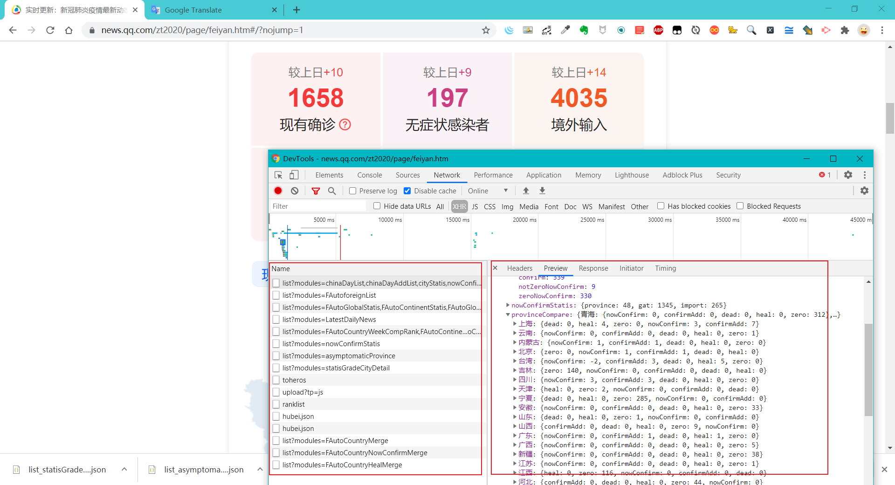

## 腾讯COVID19数据 API 分析

首先是对腾讯COVID数据API的获取分析，载入页面之后可以看到以下接口，Preview 之后可以看到正是我们所需要的数据。各个数据接口分析如下：

在查看各个数据接口的数据之后，由于数据量太大，确定了下面几个接口，并将其返回的 JSON 数据下载到了本地进行分析

**已下载数据 /static/json_data：**

近期31省区市本土病例（等级排序）：https://api.inews.qq.com/newsqa/v1/query/inner/publish/modules/list?modules=statisGradeCityDetail

国内数据概览：https://api.inews.qq.com/newsqa/v1/query/inner/publish/modules/list?modules=chinaDayList,chinaDayAddList,cityStatis,nowConfirmStatis,provinceCompare

现有无症状感染者：https://api.inews.qq.com/newsqa/v1/query/inner/publish/modules/list?modules=asymptomaticProvince

国外数据：https://api.inews.qq.com/newsqa/v1/automation/modules/list?modules=FAutoforeignList

全球数据：https://api.inews.qq.com/newsqa/v1/automation/modules/list?modules=FAutoGlobalStatis,FAutoContinentStatis,FAutoGlobalDailyList,FAutoCountryConfirmAdd

## 确定目标数据

上面的数据量过多，并不是全都要==因此要过找到我们需要的数据，并滤掉一些数据。
需要的数据：
- 国内概览数据 对应 list_chinaDayList.json > chinaDayList 
- 近期31省区市本土病例排序 对应 list_statisGradeCityDetail.json
- 现有无症状感染者省份数据排序 对应 list_asymptomaticProvince.json confirm

### 确定技术栈
后端：Python Flask框架
前端图表渲染：Echarts

